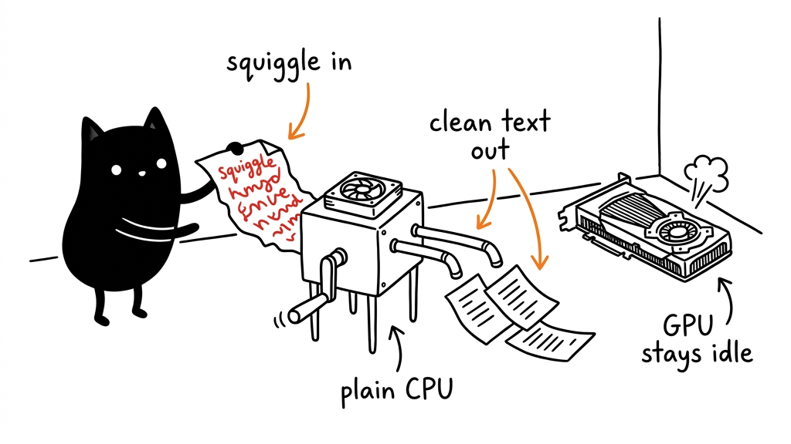
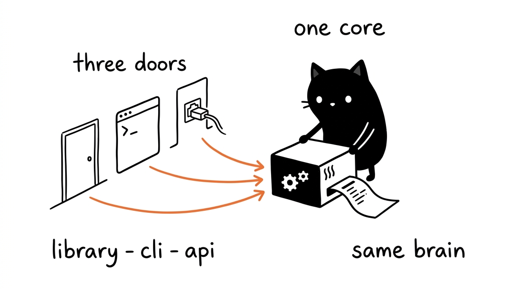

# Miaw Solver (Captcha Solver)

**Self-hosted CAPTCHA solver — CPU-first.** No GPU required, no per-solve cost.

[](https://github.com/zakiyys/miaw-solver/actions/workflows/ci.yml)
[](LICENSE)
[](https://www.python.org/)
[](#cpu-vs-gpu)

> **Miaw Solver** — one core, three interfaces: **Library · CLI · API Server**.
> The API is a **drop-in replacement for 2captcha** — just change `base_url` and you're done.



---

## Why?

Commercial captcha services (2Captcha, and friends) charge per solve. Most common
captchas — distorted text, simple questions, audio — **don't need a GPU and don't need
to be paid for**. This project solves them locally, on any CPU.

| CAPTCHA type | Local? | Notes |
|---|---|---|
| Image / distorted text | ✅ | ddddocr, ~50–150 ms on CPU |
| Text ("4 + 8 = ?") | ✅ | rules + safe arithmetic evaluation (ID & EN) |
| Audio (speech) | ✅ | faster-whisper, `base` model, ~1–2 s on CPU |
| reCAPTCHA v2 | ✅ | checkbox + audio-challenge route via Playwright (headless Chromium) |
| hCaptcha (grid) | 🚧 | widget flow works; tile selection needs a vision model — use 2captcha fallback |
| reCAPTCHA v3 / Turnstile | ❌ | needs fingerprint + residential proxy |

---

## Documentation

| Doc | Contents |
|---|---|
| [docs/engines.md](docs/engines.md) | How each of the four engines works, its cost, its limits |
| [docs/api.md](docs/api.md) | HTTP reference — native endpoints + 2captcha-compatible contract |
| [docs/deployment.md](docs/deployment.md) | systemd, Docker, config table, reverse proxy, scaling |
| [examples/](examples/) | Runnable library, CLI, curl, and custom-engine examples |
| [CHANGELOG.md](CHANGELOG.md) | Release history |
| [CONTRIBUTING.md](CONTRIBUTING.md) | Ground rules, setup, how to add an engine |


---

## Proof it works

Real output, nothing hand-waved. Every line below is a command result.

### Text CAPTCHA

```console
$ miaw-solve text "7 x 6"
42
$ miaw-solve text "tiga tambah lima"
8
$ miaw-solve text "dua puluh dibagi empat"
5
```

Works in Indonesian and English, with digits or spelled-out numbers.

### Image CAPTCHA (ddddocr)

```console
$ miaw-solve image testdata/captcha_like.png
8f3kd
```

### Audio CAPTCHA (faster-whisper)

```console
$ miaw-solve audio testdata/audio_4c7n.wav
4C7N
```

The fixture was synthesized as `"4 c 7 n"` and comes back as `4C7N` — ~1–2 s on CPU.

### reCAPTCHA v2 (headless Chromium)

Against Google's official v2 test sitekey, the grid route renders the widget and
collects a token — proof the browser flow is wired correctly:

```console
$ python scripts/smoke_grid.py
=== smoke test jalur grid (reCAPTCHA v2 test-key) ===
  origin       : http://127.0.0.1:35261/
  widget       : ter-render, checkbox ada ✅
  token len    : 1700
  HASIL        : ✅ jalur grid berfungsi (token 1700 char)
```

> Two field notes worth having, both learned the hard way:
> **(1)** reCAPTCHA rejects the `about:blank` origin — a widget rendered with
> `page.set_content()` shows *"ERROR for site owner: Invalid domain for site key"*
> instead of a checkbox. It must be served from a real `http(s)` origin, so the
> worker spins up a tiny local HTTP server. **(2)** the widget needs ~1.5 s to
> settle; clicking too early times out.

### API (2captcha-compatible)

```console
$ curl -X POST http://localhost:8100/solve -F "file=@captcha.png"
{"status":1,"request":"8f3kd","source":"local"}

$ curl -X POST http://localhost:8100/solve/text -F "question=7 x 6"
{"status":1,"request":"42","source":"local"}

$ curl -X POST http://localhost:8100/solve/audio -F "file=@challenge.wav"
{"status":1,"request":"4C7N","source":"local"}
```

Full 2captcha mirror also verified — `/in` with `method=post`, `method=base64`,
`method=textcaptcha`, and auto-detected audio, each followed by `/res?action=get`:

```console
$ curl -X POST http://localhost:8100/in -F "file=@captcha.png" -F "method=post"
{"status":1,"request":"9853a3b6b613445f"}
$ curl "http://localhost:8100/res?action=get&id=9853a3b6b613445f"
{"status":1,"request":"8f3kd"}
```

An unknown id returns `{"status":0,"request":"CAPCHA_NOT_READY"}`, matching 2captcha.

### Auth & rate limiting

Both verified, not just claimed:

```console
$ curl -o /dev/null -w "%{http_code}" -X POST localhost:8100/solve -F "file=@x.png"
401                          # no API key while MIAW_API_KEY is set
$ curl -o /dev/null -w "%{http_code}" -H "X-API-Key: <your-key>" \
    -X POST localhost:8100/solve/text -F "question=1+1"
200 200 429 429 429          # MIAW_RATE_LIMIT=3 → the 4th request is throttled
```

### Tests

```console
$ pytest tests/
20 passed in 2.79s
```

20 tests, CPU-only, no network in the default suite. CI runs them on Python
3.10 / 3.11 / 3.12 **plus** a Docker job that boots the image and smoke-tests the API.

---

## Quick start

### 1. CLI

```bash
pip install .
miaw-solve image captcha.png       # image  → "8f3kd"
miaw-solve text "What is 7 x 6 ?"   # text   → "42"
miaw-solve audio challenge.wav      # audio  → "4C7N"
cat captcha.png | miaw-solve image -   # read from stdin
```

Optional extras:

```bash
pip install ".[audio]"   # audio CAPTCHA   (faster-whisper)
pip install ".[grid]"    # reCAPTCHA v2    (playwright + chromium)
pip install ".[all]"     # everything
playwright install chromium            # once, only if you installed [grid]
```

### 2. Library

```python
from captcha_solver import solve_image, solve_text, solve_audio, solve

print(solve_image("captcha.png"))                 # → "8f3kd"
print(solve_text("Berapa hasil dari 4 + 8 ?"))    # → "12"
print(solve_audio("challenge.wav"))               # → "4C7N"

# or route by type once you know it
print(solve("text", "9 x 9"))                     # → "81"
```

### 3. API server (2captcha-compatible — one-line switch)

```bash
docker compose up -d                        # listens on :8100
curl -X POST http://localhost:8100/solve -F "file=@captcha.png"
# → {"status":1,"request":"8f3kd","source":"local"}
```

**Already using 2captcha?**

```diff
- base_url = "https://2captcha.com"
+ base_url = "http://localhost:8100"
```

Done. No more per-solve fees.

### Docker

```bash
docker compose up -d                      # CPU, server + audio
docker compose --profile grid up -d       # + Chromium for reCAPTCHA v2
docker compose --profile gpu up -d        # + CUDA (needs nvidia-container-toolkit)
```

Copy `.env.example` → `.env` to set the optional knobs (see [Configuration](#configuration)).

---

## 2captcha compatibility table

| 2captcha endpoint | Miaw Solver |
|---|---|
| `POST /in.php` `method=post` | `POST /in` (multipart `file`) → `{"status":1,"request":"<task_id>"}` |
| `POST /in.php` `method=base64` | `POST /in` (JSON `{"method":"base64","body":"..."}`) |
| `POST /in.php` `method=textcaptcha` | `POST /in` (form `textcaptcha=...`) |
| `POST /in.php` `method=audio` | `POST /in` (multipart `file`, audio auto-detected by magic bytes) |
| `GET /res.php?action=get&id=` | `GET /res?action=get&id=` → `{"status":1,"request":"<answer>"}` |
| `GET /res.php?action=getbalance` | `GET /balance` → `{"status":1,"request":"0.0"}` |
| *(not in 2captcha)* | `POST /solve` — answer immediately, no polling |
| *(not in 2captcha)* | `POST /solve/text`, `POST /solve/audio` |
| *(not in 2captcha)* | `GET /health`, `GET /stats` |

Polling semantics match: an unknown or expired id returns
`{"status":0,"request":"CAPCHA_NOT_READY"}`.

---

## Configuration

All optional — with no configuration the solver just runs locally and free.

| Env var | Default | Meaning |
|---|---|---|
| `MIAW_FALLBACK` | `0` | `1` = when the local solver fails, forward images to 2captcha (**paid**) |
| `TWOCAPTCHA_API_KEY` | — | required for the fallback to work |
| `MIAW_API_KEY` | — | if set, every endpoint except `/health` needs `X-API-Key` (or `?key=`) |
| `MIAW_RATE_LIMIT` | `0` | max requests/minute per IP; `0` = unlimited |
| `MIAW_WHISPER_MODEL` | `base` | `tiny` (fast) · `base` (balanced) · `small` (accurate) |
| `MIAW_WHISPER_DEVICE` | `cpu` | `cpu` or `cuda` |
| `MIAW_WHISPER_COMPUTE` | `int8` (`float16` on CUDA) | CTranslate2 compute type |
| `MIAW_PORT` | `8100` | host port for docker compose |

The fallback is **off by default on purpose** — a solver that silently spends money
is a bug, not a feature.

### Security

- `/health` is intentionally unauthenticated (containers need it for healthchecks).
- Rate limiting is per IP and deliberately simple; put it behind a reverse proxy
  if you expose it to the internet.
- With `MIAW_API_KEY` unset the API is **open**. Never expose it publicly like that.

---

## Dependencies

Keep the footprint honest: the **core** is tiny and pure-CPU; audio and grid are opt-in
extras, so a plain install never drags in a speech model or a browser engine.

### Core — required (image + text)

| Package | Version used | Why it's here |
|---|---|---|
| [`ddddocr`](https://github.com/sml2h3/ddddocr) | `1.6.1` | The OCR engine for distorted-text images. Ships its own ONNX model (~12 MB) inside the wheel and runs on CPU via `onnxruntime`. **Pinned** — its API and bundled model change between releases. |
| [`pillow`](https://python-pillow.org/) | `>=10` | Image decoding. Brought in for preprocessing and to normalise any input format before OCR. |
| [`numpy`](https://numpy.org/) | `>=1.24` | Array plumbing underneath ddddocr/opencv. Declared explicitly so the version floor is honest. |

Transitive (pulled in automatically, no action needed): `onnxruntime` (~1.30),
`opencv-python-headless` (~5.0) — the headless build matters, it avoids requiring a
display on a server.

### Extra: `server` — the API door

| Package | Version used | Why |
|---|---|---|
| `fastapi` | `>=0.110` | The HTTP layer. Async, and its `UploadFile` handles multipart without extra glue. |
| `uvicorn[standard]` | `>=0.27` | ASGI server. The `[standard]` variant pulls in the fast C parsers/websocket bits. |
| `python-multipart` | `>=0.0.9` | Required by FastAPI to parse `multipart/form-data` — i.e. every image upload. Easy to forget; the server 422s without it. |

### Extra: `audio` — speech CAPTCHA

| Package | Version used | Why |
|---|---|---|
| [`faster-whisper`](https://github.com/SYSTRAN/faster-whisper) | `>=1.0` (1.2.1 tested) | Speech-to-text via CTranslate2 — several times faster than the reference Whisper on the same CPU, which is why it's the audio engine here. |

Transitive: `ctranslate2` (~4.8, the actual inference runtime), `tokenizers`,
`huggingface-hub` (model download). The `base` model (~75 MB) is fetched **once** on
first audio use, then cached — mount a volume for it in Docker so restarts don't
re-download.

### Extra: `grid` — reCAPTCHA v2 / hCaptcha

| Package | Version used | Why |
|---|---|---|
| [`playwright`](https://playwright.dev/python/) | `>=1.40` (1.63.0 tested) | Drives a real headless Chromium to reach the audio challenge. Heavier than everything else — kept behind an extra so it's never installed by accident. |

Plus the browser binary itself: `playwright install chromium` (~170 MB). Not a Python
dependency, so it can't be declared in `pyproject.toml` — you install it once.

### System packages (Docker image only)

`libgl1`, `libglib2.0-0` (needed by opencv even in headless mode) and `ffmpeg`
(decodes any audio format the client sends). All handled by the provided `Dockerfile`.

### Deliberate non-dependencies

- **No PyTorch.** ddddocr speaks ONNX and faster-whisper speaks CTranslate2, so the
  multi-GB torch install is avoided entirely — that is what keeps the CPU image small.
- **No `requests`.** HTTP calls to 2captcha use the standard library (`urllib`), so the
  core has zero HTTP dependencies.
- **No cloud calls by default.** Nothing leaves the machine unless you explicitly set
  `MIAW_FALLBACK=1`.

Install size guide: core ≈ 200 MB, `+server` ≈ +40 MB, `+audio` ≈ +150 MB (plus the
75 MB model on first run), `+grid` ≈ +170 MB of browser.

### Test tooling

| Package | Version used | Why |
|---|---|---|
| `pytest` | `>=8` (9.1.1 tested) | The test runner. All tests are offline and deterministic. |
| `hatchling` | build backend | Declared as `build-system` in `pyproject.toml`; no manual install needed. |

---

## Project layout

```text
miaw-solver/
├── captcha_solver/          # the package (import name stays `captcha_solver`)
│   ├── __init__.py          #   public API + __version__
│   ├── core.py              #   the brain — solve_image / solve_text / solve_audio / solve
│   ├── config.py            #   every knob in one place, env-driven, redacted() view
│   ├── store.py             #   task queue — MemoryStore / SqliteStore
│   ├── logging_setup.py     #   text or JSON logs, secret-safe
│   ├── fallback.py          #   optional 2captcha safety net (opt-in, double-gated)
│   ├── cli.py               #   🚪 door 1 — `miaw-solve`
│   └── workers/
│       ├── ocr.py           #   🧩 image → ddddocr
│       ├── text.py          #   🧩 text  → rules + safe arithmetic
│       ├── audio.py         #   🧩 audio → faster-whisper
│       └── grid.py          #   🧩 grid  → Playwright (reCAPTCHA v2 / hCaptcha)
├── server.py                # 🚪 door 3 — FastAPI, 2captcha-compatible
├── cli.py                   # thin shim for `python cli.py`
├── docs/                    # engines · api · deployment
├── examples/                # runnable library / CLI / curl / custom-engine samples
├── tests/                   # offline suite (core · store · grid · plugins)
├── testdata/                # small fixtures used by tests and examples
├── scripts/                 # dev-only helpers (generate fixtures, live grid proof)
├── assets/                  # README banners
├── Dockerfile               # multi-stage: core / grid / gpu
└── docker-compose.yml       # profiles: default · grid · gpu
```

Library is door 2 — there is no separate directory for it: `import captcha_solver`
*is* the library, and the CLI and server are both thin wrappers over it.

### Extension point

Add your own engine without touching the core:

```python
from captcha_solver import register_engine, solve

register_engine("roman", lambda q: str(roman_to_int(q)))
solve("roman", "XIV")          # -> "14"
```

Built-in engine names cannot be overridden, so a stray registration can never
silently change default behaviour. See `examples/custom_engine.py`.


---

## Architecture

```text
captcha_solver/
├── core.py              # the brain — solve_image / solve_text / solve_audio / solve
├── fallback.py          # optional 2captcha safety net (local-first)
├── cli.py               # 🚪 entry point: miaw-solve
└── workers/
    ├── ocr.py           # 🧩 image   → ddddocr
    ├── text.py          # 🧩 text    → rules + safe AST arithmetic
    ├── audio.py         # 🧩 audio   → faster-whisper
    └── grid.py          # 🧩 grid    → Playwright (reCAPTCHA v2 audio route)
server.py                # 🚪 FastAPI server, 2captcha-compatible
tests/                   # test suite (runs on CPU-only CI)
```

**Design rule:** all solving logic lives in `captcha_solver/` (the library).
The CLI and API server are thin wrappers — never put logic in them.



### Lazy loading

`import captcha_solver` stays light. Heavy models (ddddocr's ONNX graph, the
whisper weights, Chromium) are only loaded when a door actually asks for that
captcha type. The core holds one singleton per worker, created on first use.

---

## CPU vs GPU

Default is CPU-only, and that is the point: the test suite runs on free CI runners
and the Docker image has no CUDA dependency. A GPU is a **turbo option**, not a
requirement — `docker compose --profile gpu up -d` uses the CUDA image and speeds
up the whisper audio worker.

---

## Tests

```bash
pytest tests/ -v                # or: python tests/test_core.py
```

CI runs on GitHub Actions across Python 3.10 / 3.11 / 3.12 — **CPU-only runners**,
which proves the project needs no GPU — plus a Docker job that boots the image,
waits for `/health`, and checks an API response.

---

## Roadmap

- **v0.1** — core + CLI + library + API (image & text)
- **v0.2** — audio (faster-whisper), 2captcha fallback, auth + rate limit, Docker ♻️
- **v0.3** — grid owner: reCAPTCHA v2 (✅ verified) + hCaptcha (🚧)
- **v0.4** — persistent task store, structured logging, metrics
- **v1.0** — stable API, docs site, published wheel + GHCR image

---

## License

MIT — see [LICENSE](LICENSE).
